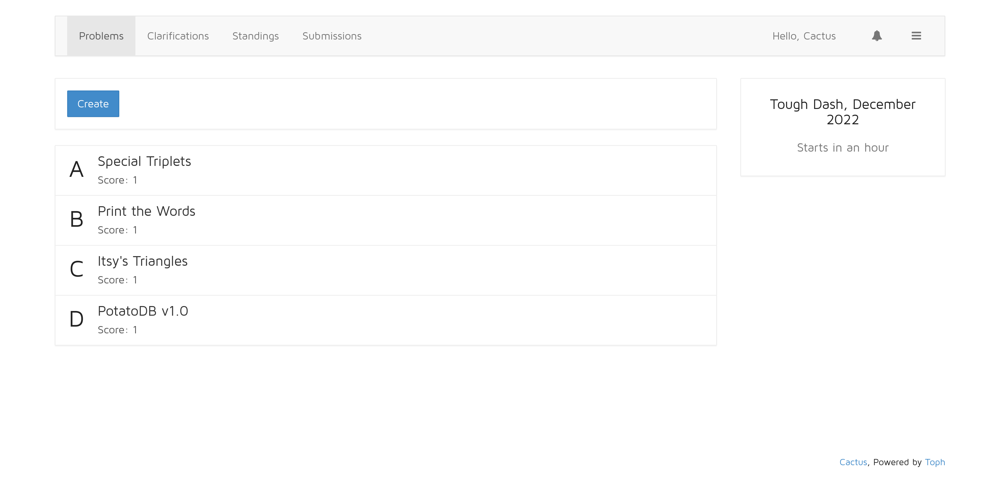

# Cactus

[](https://www.codetriage.com/furqansoftware/cactus)

Cactus is a programming contest hosting application.



## Build

``` sh
make
````

## Usage

```
sudo ./cactus
```

## Why Cactus?

In 2014, I wanted to build an alternative to PC^2; a better way of hosting on-site programming contests over the local area network. Unlike PC^2, Cactus doesn't need a client to be installed on every computer. Cactus can be distributed as a single all-in-one binary.

Cactus served as my creative outlet until I started working on [Toph](https://toph.co).
